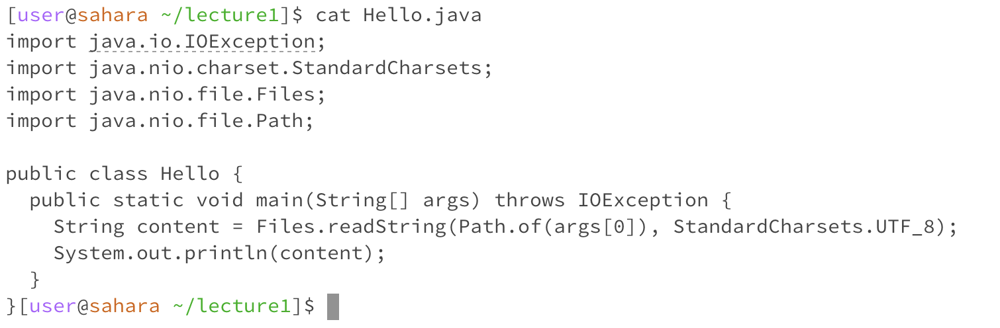

## CSE 15L Lab Report 1

Author: Chia-Lun Tsao (Gallant)
Professor Onat Gungor
Due 9th October 2023

# First Command: cd
1. Without Args\
\
The working directory was /home/lecture1 when I ran the command. There were no errors in the output. _cd_ with no arguments changes the directory to the home directory. This is probably because _cd_ with no arguments changes the directory to the default directory, which in my system is just the home directory.
2. Directory Arg\
\
The working directory was /home when I ran the command. There were no errors in the output. _cd_ with a directory argument changes the directory to the input directory if it exists within the working directory. In this case there were no errors because lecture1 is a directory in the home directory so _cd_ just changes the working directory to lecture1.
3. File Arg\
\
The working directory was /home/lecture1 when I ran the command. There was an error in the output as I am trying to change the directory into a file, which is not possible as a file is not a directory.

# Second Command: ls
1. Without Args\
\
The working directory was /home/lecture1 when I ran the command. There were no errors in the output. _ls_ with no arguments lets the terminal lists the directories and files under the current working directory. For this screenshot, since en-us.txt, en-mx.txt, ji.txt, and zh-cn.txt were all in the file of _messages_, these files will be the ones listed in the terminal.
2. Directory Arg\
\
The working directory was /home/lecture1 when I ran the command. There were no errors in the output. _ls_ with a directory as the argument will list all the files and directories in the input directory. In the screenshot, all the text files were in the messanges folder, hence _ls_ with directory argument will list all the files and the directories within the input directory.
3. File Arg\
\
The working directory was /home/lecture1 when I ran the command. There were no errors in the output. _ls_ with a file as the input will return the file name and nothing else (which is exactly the user's input). This is probably because files are the smallest unit in which information is stored, so there are no further branches to list.

# Third Command: cat
1. Without Args\
\
The working directory was ~/lecture1 when I ran the command. There were no errors in the output. _cat_ with no arguments leads to the terminal waiting for my input. When I enter any string into the terminal, it simply copies the string and returns it back to me. This may be because there is nothing to read if there are no arguments so instead the terminal will just accept the user's inputs and read them.
2. Directory Arg\
\
The working directory was ~/lecture1 when I ran the command. There were no errors in the output. _cat_ with a directory argument just leads to the terminal printing the _cat_ command followed by the input directory then 'Is a directory', which can be because there is no information stored inside the directory except addresses to other files and directories.
3. File Arg\
\
The working directory was ~/lecture1 when I ran the command. There were no errors in the output. _cat_ with a file argument simply displays the contents of the file to the user. This is probably because _cat_ is a method of viewing the content of a file without dealing any damage (modification) to the file so is safer.
