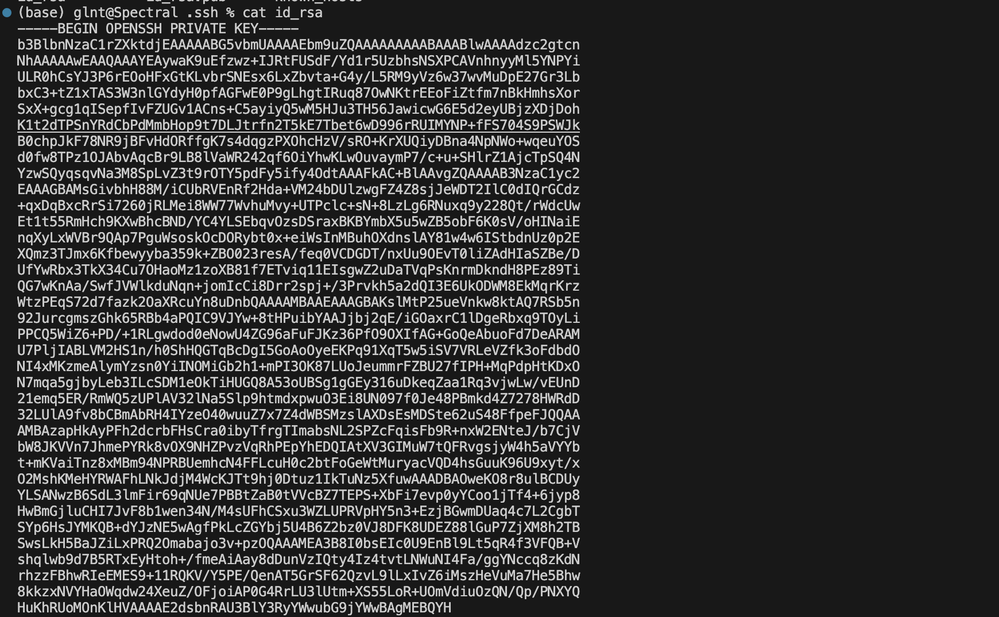

# Lab Report 2 🤓

## Part 1
Here is the first add operation:\
\
For the first add operation, the `handleRequest()` method is called with value `url=http://localhost:6480/add-message?s=cse15l`. Before the method call, the string `s` that is being displayed on the screen in empty. As the URL is passed in, it falls into the `else` clause then to the `if` clause of the `handleRequest()` method as the `.contains()` method found a substring in the path of the URL containing `\add-message`. After, the number `n` is incremented by 1 and the message is concatonated in the format specified, ending with a `\n` as we need to prepare for the entry as well.
Here is the second add operation:\
\
For the second add operation, the `handleRequest()` method is called with value `url=http://localhost:6480/add-message?s=slay_the_spire`. Before the method call, the string `s` has value `"1. cse15l\n"`. As the URL is passed in, it again falls into the `else` clause then to the `if` clause because the `.contains()` method found a substring in the path of the URL containing `add-message`. Then `n` is incremented 1 (and is now 2) and the string `s` is concatonated so it becomes `"cse15l\n2. slay_the_spire\n"`.

## Part 2
I know technically I should not be showing my private SSH, but I need evidence that I did this assignment :l
Screenshot for private ssh key:\
\
Screenshot for public ssh key:\
\
Screenshot for accessing ieng6 server without password:\

## Part 3
In lab 2, I learned to access the UCSD ieng6 server by using the `ssh` command, and also learned how to login to my UCSD server account by creating a secure copy of my public key into the UCSD ieng6 server in lab 3. Moreover, I also learned how to create my own server on my local machine using the built in java packages such as URI.
