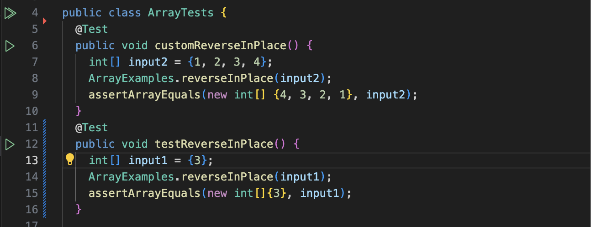
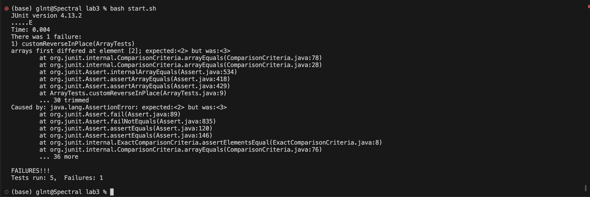

# Lab Report 3 🤓

Author: Chia-Lun Tsao (Gallant)\
Professor Onat Gungor\
Due 5th November 2023

## Part 1 - Bugs

__Failure-inducing input__:
```
@Test
public testReverseInPlace() {
  int[] input = {1, 2, 3, 4};
  ArrayExamples.reverseInPlace(input);
  assertArrayEquals(new int[] {4, 3, 2, 1}, input);
}
```
__Non-failure-inducing Input__:
```
@Test
public testReverseInPlaceAgain() {
  int[] input = {3};
  ArrayExamples.reverseInPlace(input);
  assertArrayEquals(new int[] {3}, input};
}
```
__Symptoms__: For the failure-inducing output, the output was {4, 3, 3, 4}, but expected was {4, 3, 2, 1}, hence VSCode indicates that the third entry in the array was 3 but expected was 2. Here is the image for the running JUnit with the two inputs shown above:


Notice that there is nothing for the input not producing the error as it passed the test so nothing occured.

__Bug__: The code before and after adjustments are shown below:
```
// Changes the input array to be in reversed order (Before change)
static void reverseInPlace(int[] arr) {
  for(int i = 0; i < arr.length; i += 1) {
    arr[i] = arr[arr.length - i - 1];
  }
}
```
```
// Changes the input array to be in reversed order (After change)
static void reverseInPlace(int[] arr) {
  for(int i = 0; i < arr.length / 2; i += 1) {
    int temp = arr[i];
    arr[i] = arr[arr.length - i - 1];
    arr[arr.length - i - 1] = temp;
  }
}
```
Before I fixed the code, the method `reverseInPlace()` only moves elements in the back of the array to the front but does nothing else to the elements in front of the array. As a result, we will get a symmetric array consisting of the latter of the half being inverted to the front. As for the code snippet below, we created a temporary variable to store the element that is being switched so that we could perform switching between the `i`th and the `arr.length-i-1`th element, effectively reversing the array in place.

## Part 2 - Researching Commands
> References
