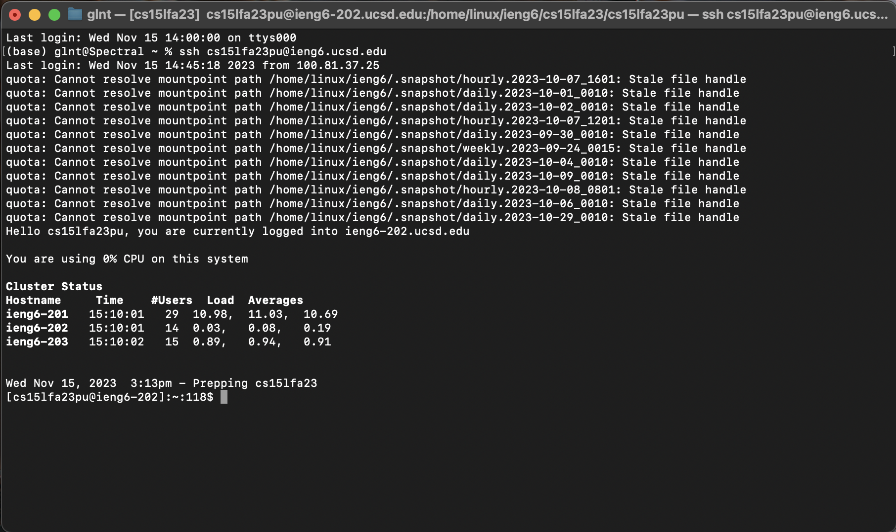
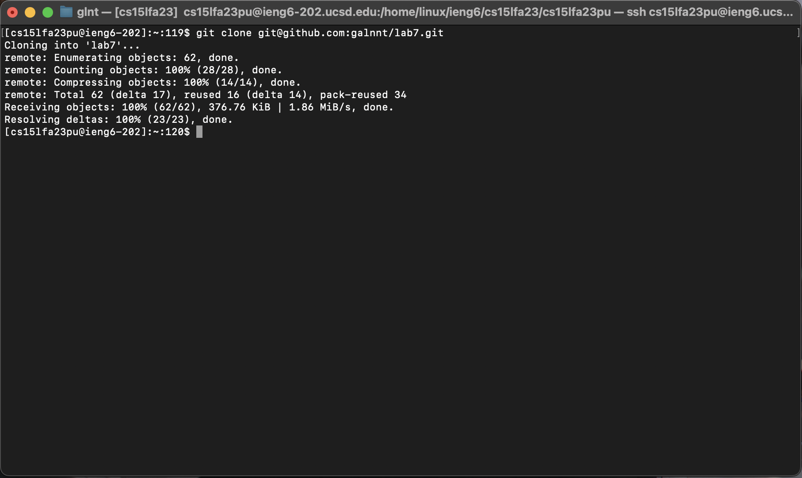
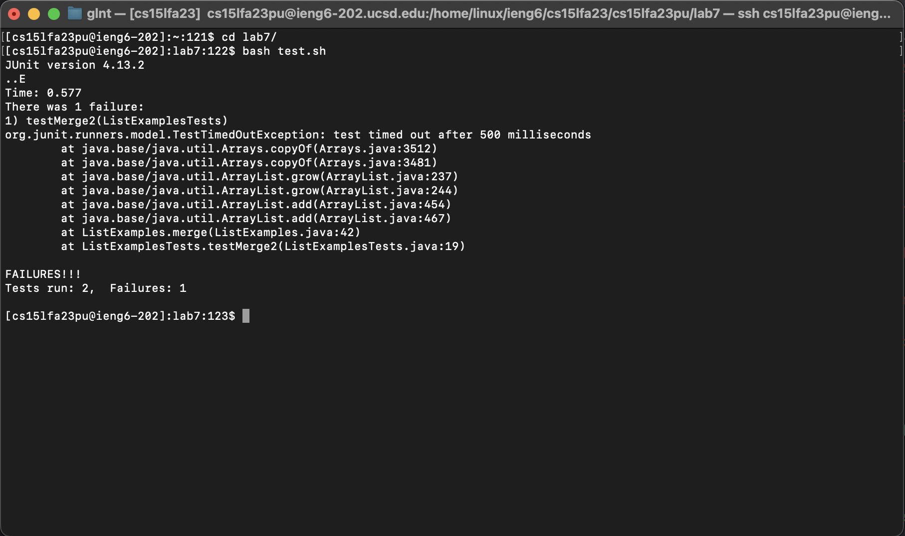
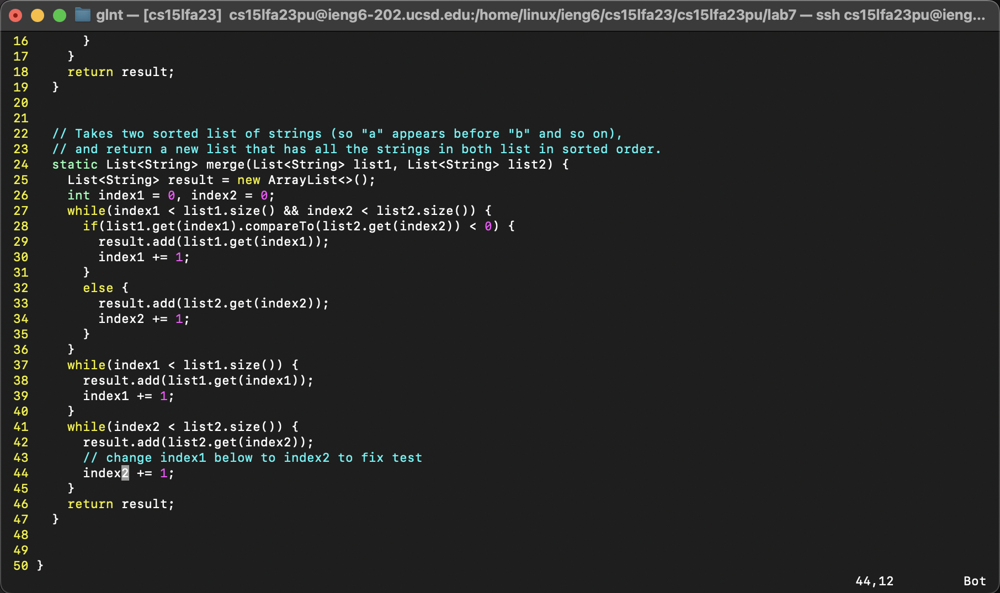
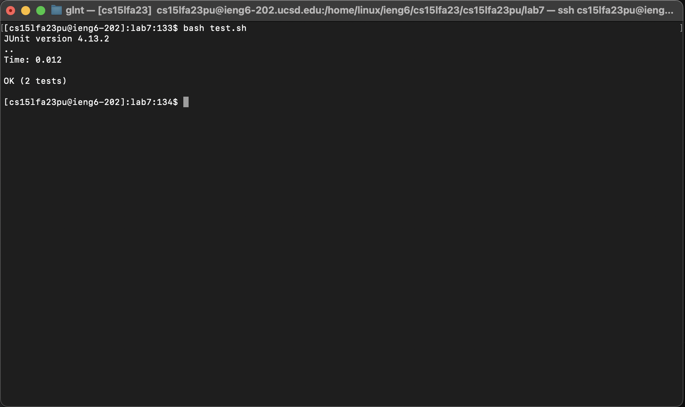
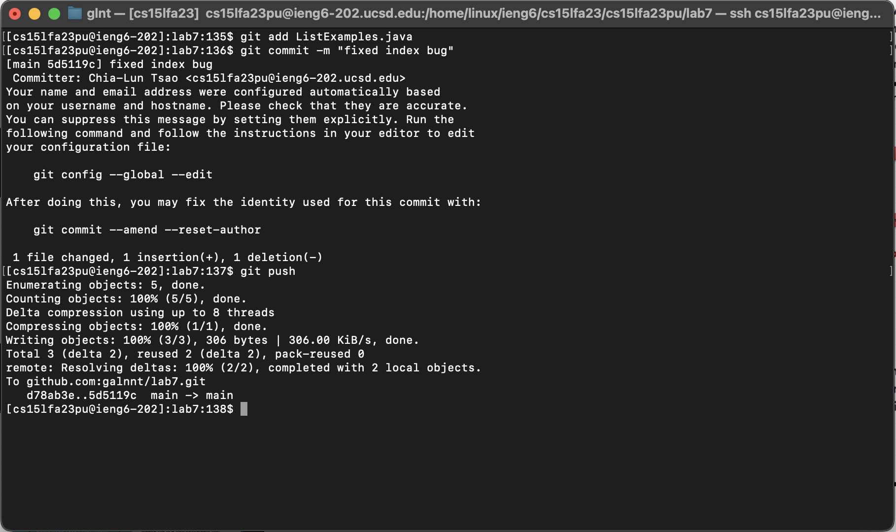

# Lab Report 4 🤓

Author: Chia-Lun Tsao (Gallant)\
Professor Onat Gungor\
Due 19th November 2023

## Here are the steps and the screenshots that I took for steps 4-9 on lab 7:
### Step 4: Log into ieng6

I typed `ssh cs15lfa23pu@ieng6.ucsd.edu <enter>`

`<enter>` executes the command above so I got connected into my ieng6 account.

### Step 5: Cloning the fork from my repository in my Github account

I typed `git clone <cmd> <v> <enter>`

`<cmd> <v>` just pastes the ssh key I copied from my fork, and `<enter>` executes the command so the repository lab7 is cloned into my ieng6 account.

### Step 6: Run the tests, demonstrating that they fail

I typed `cd l<tab> <enter>` then `bash test.sh <enter>`.

The `tab` lets the terminal autocomplete the directory to `lab7/`, and `<enter>` executes the command `cd lab7/` so we go into the lab7 folder.

`bash test.sh` runs the shell script file for the JUnit testing of the Lists, and `<enter>` executes the command so we are able to see an error message.

### Step 7: Edit the code to fix the test

I typed `vim ListExamples.java <enter> <G> <up> <up> <up> <up> <up> <up> <w> <e> <r> <2> <:> <w> <q>`

`vim ListExamples.java <enter>` enters the file ListExamples.java using vim. Then I used `<G>` to navigate to the end of the java file, which is the 50th line. After, I pressed the `<up>` key six times to navigate to the 44th line, which is where the bug is located at. Then I pressed `<w>` to go to the next word, which is "index1". I then pressed `<e>` to move the cursor to the end of this word, hence the cursor is now at the "1" in "index1". After, I pressed `<r2>` to replace the "1" with a "2". Finally, I saved and quit the file by pressing on `<:wq>`.

### Step 8: Run the tests, demonstrating that they succeed

I typed `bash t<tab> <enter>`

`<tab>` autofills the entry to test.sh, and `<enter>` executes the command. The output of success is shown in the image above.

### Step 9: Commit and push the resulting change to my Github account

I typed `git add ListExamples.java <enter>`, `git commit -m "fixed index bug" <enter>`, and `git push <enter>`.

In all of the commands above, `<enter>` executes the command that I was typing.

`git add ListExamples.java` adds ListExamples.java to the staging area of git as it is the only file that I modified.

`git commit -m "fixed index bug"` moves the files that I added from the staging area to the git directory, with the commit message "fixed index bug".

`git push` pushes the committed message to the remote git directory on Github.
