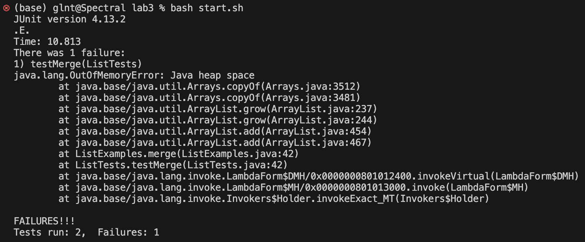
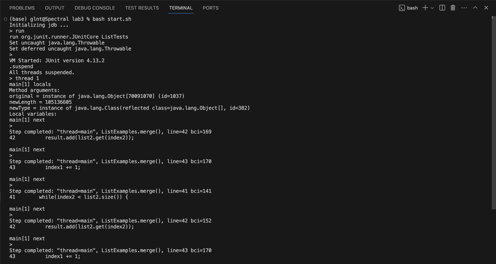
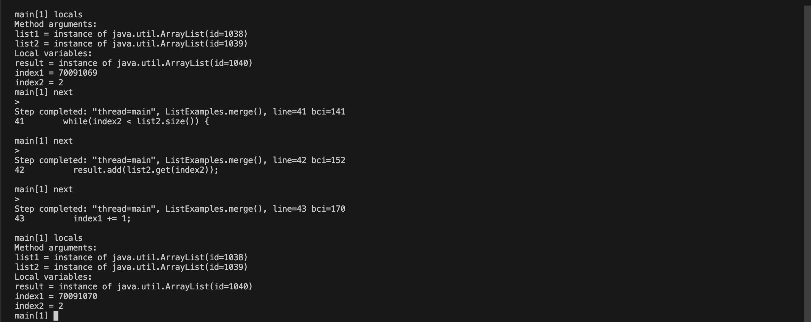
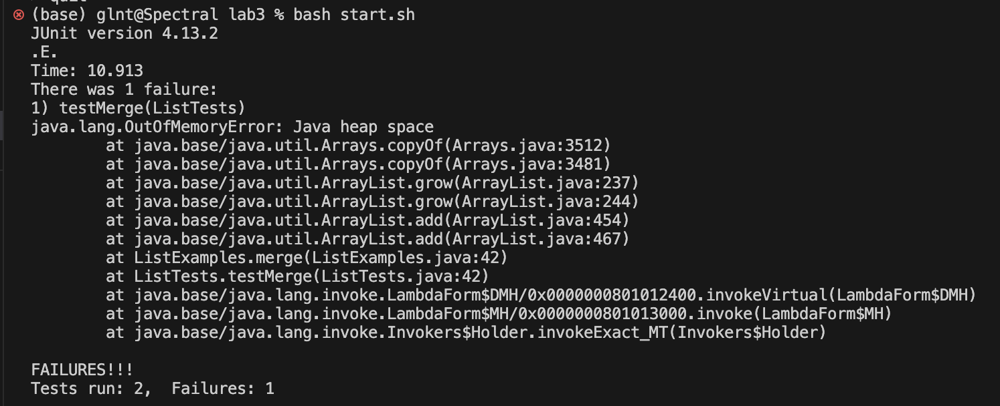
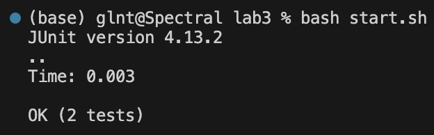

# Lab Report 5 🤓

Author: Chia-Lun Tsao (Gallant)\
Professor Onat Gungor\
Due 19th November 2023

## Part 1 - Debugging Scenario
### Post from Student

Student: I encountered this error when I was testing my code for the ListExamples.java file. Can you help with fixing my code?
Here is the error message when I ran my tests. I think it happened because one of the while loops was running forever causing the program to crash?


### Reply from the TA

TA: Hmm... Looks like your java program ran out of heap space. Since we just recently learned this, why not try using the java debugger and see if you could solve the issue for the infinite loop by looking at the local variables using `suspend` then followed by `locals`?

### Screenshot of student trying out what the TA said

Student: Hi, I tried running jdb on the ListTests file, and I realized that during the while loop where the program is supposed to 
increment `index2`, after a few runs in jdb `index2` was never changed. Therefore, I think it's because in the while loop that the program was supposed to increment `index2`, I incremented `index1`, which implied that `index2` is never changed and will always be smaller than `list2.size()`. Thanks for the help :]



The bug is that the student incremented the wrong variable, which led to an infinite loop when the tests were ran. However, this bug 
can be subtle sometimes, as if we change the test case to
```
public class ListTests {
  @Test
  public void weirdTest() {
    List<String> strl1 = new ArrayList<>();
    List<String> strl2 = new ArrayList<>();
    List<String> strl3 = new ArrayList<>();
    strl1.add("a");
    strl1.add("b");
    strl1.add("z");
    strl3.add("a");
    strl3.add("b");
    strl3.add("z");
    assertEquals(strl3, ListExamples.merge(strl1, strl2));
  }

}
```
Then there will actually be no error reported by JUnit and the test case will pass! This is because in this case `strl2` is empty, 
meaning that the while loop that is triggering the bug will never run and we will in fact get the correct answer.

### All information regarding the setup

Here is the file & directory structure for my simulation:
```
- lab3/
  - lib/
    - hamcrest-core-1.3.jar
    - junit-4.13.2.jar
  - start.sh
  - ListExamples.java
  - ListTests.java
```
Contents of __start.sh__ before fixing the bug:
```
set -e
CLASSPATH=".:lib/hamcrest-core-1.3.jar:lib/junit-4.13.2.jar"
javac -cp $CLASSPATH *.java
java -cp $CLASSPATH org.junit.runner.JUnitCore ListTests
```
Contents of __ListExamples.java__ before fixing the bug:
```
import java.util.ArrayList;
import java.util.List;

interface StringChecker { boolean checkString(String s); }

class ListExamples {

  // Returns a new list that has all the elements of the input list for which
  // the StringChecker returns true, and not the elements that return false, in
  // the same order they appeared in the input list;
  static List<String> filter(List<String> list, StringChecker sc) {
    List<String> result = new ArrayList<>();
    for(String s: list) {
      if(sc.checkString(s)) {
        result.add(s);
      }
    }
    return result;
  }


  // Takes two sorted list of strings (so "a" appears before "b" and so on),
  // and return a new list that has all the strings in both list in sorted order.
  static List<String> merge(List<String> list1, List<String> list2) {
    List<String> result = new ArrayList<>();
    int index1 = 0, index2 = 0;
    while(index1 < list1.size() && index2 < list2.size()) {
      if(list1.get(index1).compareTo(list2.get(index2)) < 0) {
        result.add(list1.get(index1));
        index1 += 1;
      }
      else {
        result.add(list2.get(index2));
        index2 += 1;
      }
    }
    while(index1 < list1.size()) {
      result.add(list1.get(index1));
      index1 += 1;
    }
    while(index2 < list2.size()) {
      result.add(list2.get(index2));
      index1 += 1;
    }
    return result;
  }


}
```
Contents of __ListTests.java__ before fixing the bug:
```
import static org.junit.Assert.*;
import org.junit.*;
import java.util.List;
import java.util.ArrayList;

public class ListTests {

    @Test
    public void testFilter() {
        StringChecker sc = new StringChecker() {
            public boolean checkString(String s) {
            if (s.contains("s")) {
                return true;
            }
            return false;
    }
        };
        List<String> strl1 = new ArrayList<>();
        strl1.add("s");
        strl1.add("ss");
        strl1.add("sss");
        assertEquals(strl1, ListExamples.filter(strl1, sc));
    }

    @Test
    public void testMerge() {
        List<String> strl1 = new ArrayList<>();
        List<String> strl2 = new ArrayList<>();
        List<String> strl3 = new ArrayList<>();
        strl1.add("a");
        strl1.add("c");
        strl1.add("e");
        strl2.add("b");
        strl2.add("d");
        strl2.add("f");
        strl3.add("a");
        strl3.add("b");
        strl3.add("c");
        strl3.add("d");
        strl3.add("e");
        strl3.add("f");
        assertEquals(strl3, ListExamples.merge(strl1, strl2));
    }
}

```
Command line for triggering the bug:

To fix the bug, we need to change the increment of `index1` to `index2` in line 43. That way, both variables will be incremented correctly when merging the list. The clause should look as 
follows:
```
...
while(index2 < list2.size()) {
      result.add(list2.get(index2));
      index1 += 1;
    }
...
```
After fixing the bug, we can check that the code works on the tests:



## Part 2 -- Reflection
In this quarter, I think the lab design from week 7 was very cool for me. Before I took this course, I did not know that we could query data in
files using the command line. Before my thought would be that I would import the file into my jupyter notebook and do operations on them 
using the pandas library. Now I know another method of processing strings in the future. :)
